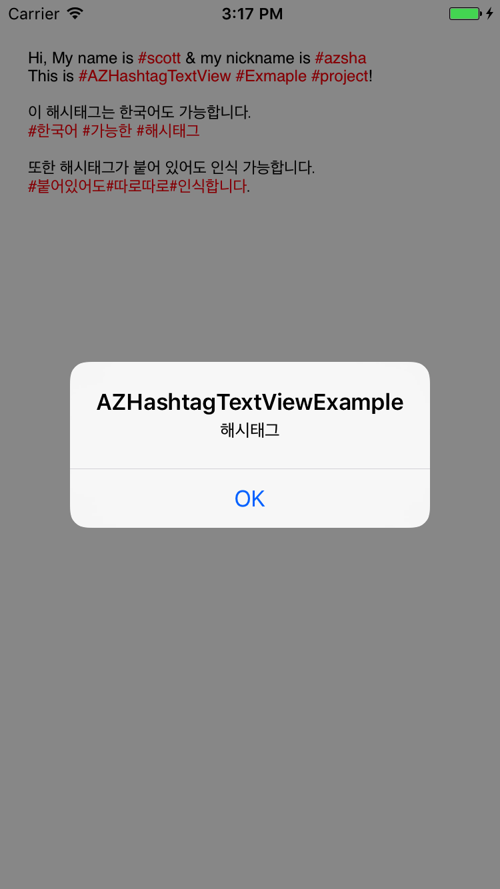

# AZHashTextView

- When you touch a hashtag in TextView, an event has occurred.

## Requirements
- Swift 3
- Xcode 8

## Integration
- Just drag AZHashTextView.swift to the project tree

## Usage
- Input viewDidload().

```swift
yourTextView.resolveHashTags()
yourTextView.linkTextAttributes = [NSForegroundColorAttributeName: UIColor.red]
yourTextView.isScrollEnabled = false
yourTextView.delegate = self
```

- Add TextView Delegate.
```swift
class ViewController: UIViewController, UITextViewDelegate {...}
```

- Add TextView Touch Delegate.
```swift
func textView(_ textView: UITextView, shouldInteractWith url: URL, in characterRange: NSRange, interaction: UITextItemInteraction) -> Bool {
    if let URL = url.scheme {
        let arrId = Int(URL)
        print(hashtagArr?[arrId!] as Any)
    }
    return false
}
```

- Please refer to the example.
